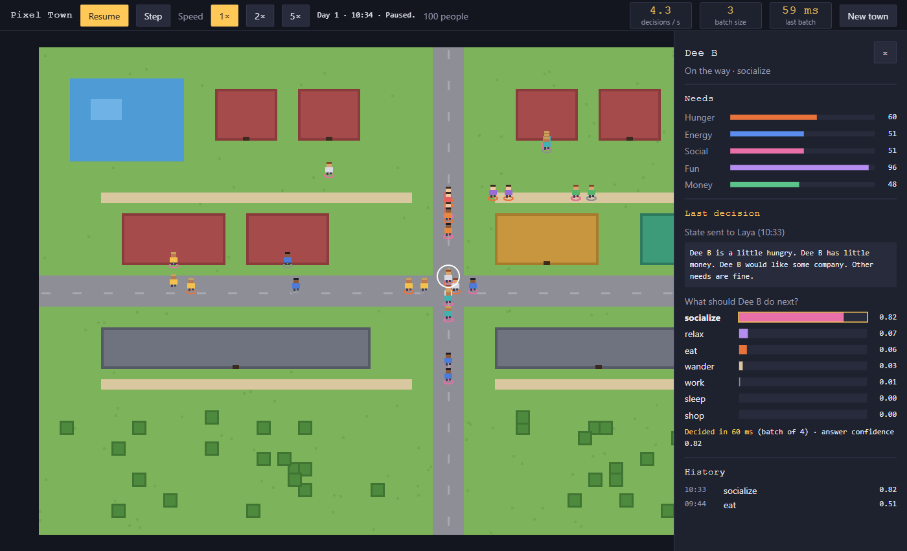

# Laya Pixel Town

A tiny pixel-art town where about a hundred people live their day, and every choice they make (eat, sleep, work, meet friends, relax, shop, wander) is decided by [Laya](https://github.com/NandhaKishorM/laya).

You are not a player. You watch. Pause the town, click anyone, and see exactly what was sent to Laya, how sure Laya was about each option, and how many milliseconds the decision took.

**Website:** https://johannesrabauer.github.io/laya-pixel-town/



## Quick start

You need Docker. With an NVIDIA GPU, run:

```bash
docker compose up --build
```

Then open **http://localhost:8765** and click **Start**.

The first start takes a while: Docker builds Laya from source and downloads its model weights (both are cached for next time).

No NVIDIA GPU? Use the CPU override instead. It works, but each decision batch is much slower (see [Speed](#speed)):

```bash
docker compose -f compose.yaml -f compose.cpu.yaml up --build
```

## What you can do

| Action | How |
|---|---|
| Start a town | Choose a population (10–300) and press **Start** |
| Pause or resume | **Pause** button or the Space bar |
| Run one step while paused | **Step** |
| Change speed | **1×**, **2×**, **5×** |
| Look at someone | Click a person. Esc or × closes the inspector |
| See an older decision | Click a row in the inspector's history |
| Zoom and move | Mouse wheel zooms, drag to pan |
| Start over | **New town** |

The top bar shows three live numbers, measured, not estimated: decisions per second, the size of the last batch sent to Laya, and how long that batch took.

## How it works

```
 Browser (canvas)  ◄── 10 snapshots/s (SSE) ──  Spring Boot app  ── batch of up to 64 ──►  laya-serve
   draws the town        positions, metrics       simulation           states            (Docker, GPU)
   inspector       ───── REST: start, pause ────►  + decision queue  ◄── one choice ─────   one forward
                                                                         per state           pass
```

1. **The simulation runs on the server.** Each person has five needs: hunger, energy, social, fun and money. Needs drift over time, and activities restore them.
2. **People who are due for a decision are queued.** As soon as Laya has answered the previous request, the app sends the next batch: the people who have waited longest, at most 64 at a time.
3. **Each person becomes one short sentence.** For example: *"Maya has no money left and needs to earn some. Maya feels lonely. Other needs are fine."*
4. **Laya answers one choice question per person.** The options are the seven activities. It returns the chosen option and a probability for each one.
5. **The person walks to the matching place** (home, work, restaurant, shop, park) and keeps doing that until the next decision. If Laya is slow or unreachable, people simply carry on with what they were doing.

The app talks to Laya's `POST /v1/systemone/batch` endpoint over plain HTTP. Nothing in the app invents or simulates Laya's answers.

## Speed

Measured on a laptop with an RTX 3060 (6 GB), using Laya's `english` checkpoint:

| Laya runs on | 64 people in one call | Small warm batch |
|---|---|---|
| CPU container | about 46 s | about 2–3 s |
| GPU container (CUDA) | about 2.7 s | about 70 ms |

Two things to know:

- **Share the GPU carefully.** Another GPU-heavy program (for example a local LLM in Ollama) can stall Laya on the same GPU completely.
- **The default setup needs CUDA 13 support.** It uses PyTorch 2.14 built for CUDA 13 (`cu130`), so your NVIDIA driver must support CUDA 13. For a different CUDA build, set `LAYA_TORCH_INDEX` and `LAYA_TORCH_VERSION`, for example `LAYA_TORCH_INDEX=cu126`.

## What we learned about the wording

Laya is a fast classifier, not a chatbot, and the text you send matters a lot:

- **Never mention what the person is doing right now.** With "Right now Maya is relaxing" in the text, Laya answered *relax* for all 100 people at 0.99.
- **Leave out the time of day, except at night.** Daytime phrases pulled answers toward *relax* too.
- **Name needs plainly, strongest first.** This worked best in our small hand-built check, at 6 out of 10.
- **Expect *relax* when needs compete.** When several needs pull at once, Laya often falls back to *relax*. That's still believable in a town.

## Configuration

| Setting | Default | Where |
|---|---|---|
| App port on your machine | `8765` | `APP_PORT` environment variable for Compose |
| Laya port on your machine | `8003` | `LAYA_HOST_PORT` |
| Laya address the app uses | `http://laya-serve:8002` in Compose | Start screen field, or `PIXELTOWN_LAYA_DEFAULT_URL` |
| How the app talks to Laya | `native` | `pixeltown.laya.client` or `PIXELTOWN_LAYA_CLIENT`: `native`, `langchain4j` or `spring-ai` |
| Laya device | `cuda` | `LAYA_DEVICE` (the CPU override sets `cpu`) |
| PyTorch build for Laya | `cu130`, `2.14.0` | `LAYA_TORCH_INDEX`, `LAYA_TORCH_VERSION` |

The three clients make the same decisions. `native` uses the JDK HttpClient and Laya's batch endpoint, so a whole batch is one call. `langchain4j` (`langchain4j-typesafe`) and `spring-ai` (`typesafe-java-sdk`) have no batch call, so the app sends one request per person in parallel and Laya answers them one after another; expect slower batches. Both libraries also hide Laya's `answer_confidence`, so the confidence shown for a decision is the library's own.

The start screen also sets the population, how often (in simulated minutes) people reconsider, and a random seed for repeatable towns.

## Development

Requirements: Java 17 or newer, and Maven 3.9.

```bash
mvn package
java -jar target/laya-pixel-town-0.1.0-SNAPSHOT.jar --pixeltown.laya.default-url=http://localhost:8003
```

`mvn package` runs the tests:

- **`WorldTest`** checks the simulation with a stand-in for Laya:
  - decisions go out in batches of at most 64;
  - pause freezes time and stops calls;
  - Step advances one step;
  - a failing Laya leaves everyone doing what they were doing.
- **`LayaContractTest`** sends a real batch through each of the three clients to Laya at `LAYA_URL` (default `http://localhost:8003`). It is skipped when no Laya server is reachable.

### Project layout

```
src/main/java/dev/rabauer/laya_pixel_town/
  LayaPixelTownApplication.java  Spring Boot entry point
  Api.java                       REST endpoints and the live event stream
  World.java                     simulation, decision queue, state text
  Person.java                    needs, activity, decision history
  Town.java                      map layout and walking routes
  LayaClient.java                what the simulation needs from Laya (interface)
  NativeLayaClient.java          JDK HttpClient, one batch call
  LangChain4jLayaClient.java     LangChain4j TypeSafeDecisionModel, one call per person
  SpringAiLayaClient.java        Spring AI TypeSafe SDK, one call per person
  LayaClients.java               picks one from the pixeltown.laya.client property
src/main/resources/static/       the web front end (canvas, no build step)
site/                            marketing website, published to GitHub Pages
compose.yaml, compose.cpu.yaml   one-command setup with Laya
_bmad-output/                    UX documents, mocks and the spec this was built from
```

## Not built yet

- A "not sure" state, where a person keeps their activity when Laya's confidence is low.
- Selecting people with the keyboard only.
- Mobile layout.

## Credits

[Laya](https://github.com/NandhaKishorM/laya) is an open-source (Apache-2.0) decision engine by NandhaKishorM. This project builds it unchanged from its upstream repository.
